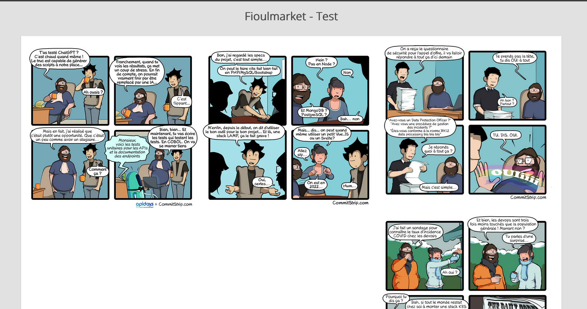

test-dev
========

Un stagiaire à créer le code contenu dans le fichier src/Controller/Home.php

Celui permet de récupérer des urls via un flux RSS ou un appel à l’API NewsApi. 
Celles ci sont filtrées (si contient une image) et dé doublonnées. 
Enfin, il faut récupérer une image sur chacune de ces pages.

Le lead dev n'est pas très satisfait du résultat, il va falloir améliorer le code.

Pratique : 
1. Revoir complètement la conception du code (découper le code afin de pouvoir ajouter de nouveaux flux simplement) 

Questions théoriques : 
1. Que mettriez-vous en place afin d'améliorer les temps de réponses du script
2. Comment aborderiez-vous le fait de rendre scalable le script (plusieurs milliers de sources et images)


Réponses aux questions :

Améliorations Apportées :

1.a Refactoring du Code:
Découpage du code en plusieurs classes/services pour respecter le principe de responsabilité unique qui fait partie de principe (SOLID).
Création de classes distinctes pour la gestion des flux, le filtrage des images, la récupération des images, la gestion des liens.@

1.b Gestion des Erreurs:
Utilisation du système de journalisation (logger) pour enregistrer les erreurs et les informations utiles.
Mise en place de messages d'erreur plus descriptifs pour faciliter le débogage.

1.c Paramètres de Configuration:
Utilisation des paramètres de configuration Symfony pour stocker des valeurs telles que les URL de flux, les clés API

1.e Optimisation du Code:
Utilisation des services Symfony pour injecter des dépendances plutôt que d'instancier des objets directement dans les méthodes.

Structure du Projet

le projet est organisé selon une structure modulaire qui favorise la lisibilité, la maintenance et l'extensibilité. Voici une vue d'ensemble de la structure :
```bash
src/Controller/HomeController.php: Ce fichier contient le contrôleur principal responsable de l'orchestration des différentes étapes du processus.
```
```bash
src/Service/FluxManager.php: Service pour la gestion des flux RSS et API.
```
```bash
src/Service/ImageFilter.php: Service pour le filtrage des liens d'images.
```
```bash
src/Service/LinkManager.php: Service pour la gestion des liens.
```
```bash
src/Service/ImageManager.php: Classe de coordination qui utilise les différents services mentionnés ci-dessus pour récupérer et traiter les images à partir des flux RSS et de l'API.
```

Cette structure offre une séparation claire des responsabilités, facilitant ainsi l'extension du code et la maintenance à long terme. Chaque service a une tâche spécifique, ce qui rend le code plus lisible et modulaire.

Réponses  Théoriques : amélioration des Temps de Réponse du Script

2.a Pour améliorer les temps de réponse du script, voici quelques recommandations :
```bash
Traitement Asynchrone: Utilisation de tâches asynchrones pour traiter plusieurs flux simultanément, réduisant ainsi les temps d'exécution.
```
```bash
Utilisation de Workers: Mise en place d'une architecture de type worker pour distribuer la charge de travail, surtout avec plusieurs milliers de sources.
```
```bash
Optimisation des Requêtes Réseau: Optimisation des requêtes en utilisant des connexions persistantes et en minimisant le nombre de requêtes.
```

2.b Scalabilité du Script

Pour rendre le script scalable face à plusieurs milliers de sources et images, voici quelques suggestions :
Parallelisation: Exploration de bibliothèques ou de composants Symfony qui facilitent la parallélisation des tâches pour améliorer les performances (exemple l'uitlisation  Symfony Messenger ).
Utilisation de Cache Distribué: Utilisation d'un système de cache distribué pour stocker les résultats intermédiaires et partager la charge entre plusieurs instances du script ( exmple avec redis).
Optimisation de l'Algorithme: Revue de l'algorithme pour garantir son efficacité, en particulier avec un grand nombre de flux .
Load Balancing: Utilisation d'un système de load balancing si plusieurs serveurs sont disponibles pour répartir la charge.


## Guide d’Installation


### 1. **Récupération du Projet:**
   ```bash
   git clone https://github.com/Flanord/Fioulmarket_Test-technique.git
   ```
### 2. **Configuration des Variables d’Environnement:**
   ```bash
   cp .env.template .env
   ```
Modifiez le fichier `.env` avec vos valeurs.
    ```
    BASE_URL_RSS=
    BASE_URL_API=
    API_KEY=
    ```
### 3. Installer les packages
    composer install
### 4. Démarrer le serveur (seulement si vous n'avez pas déjà un serveur web sur votre machine)
Démarrer le serveur symfony avec la commande suivante
    php -S localhost:8000 -t public ou symfony serve

#RESULTAT


